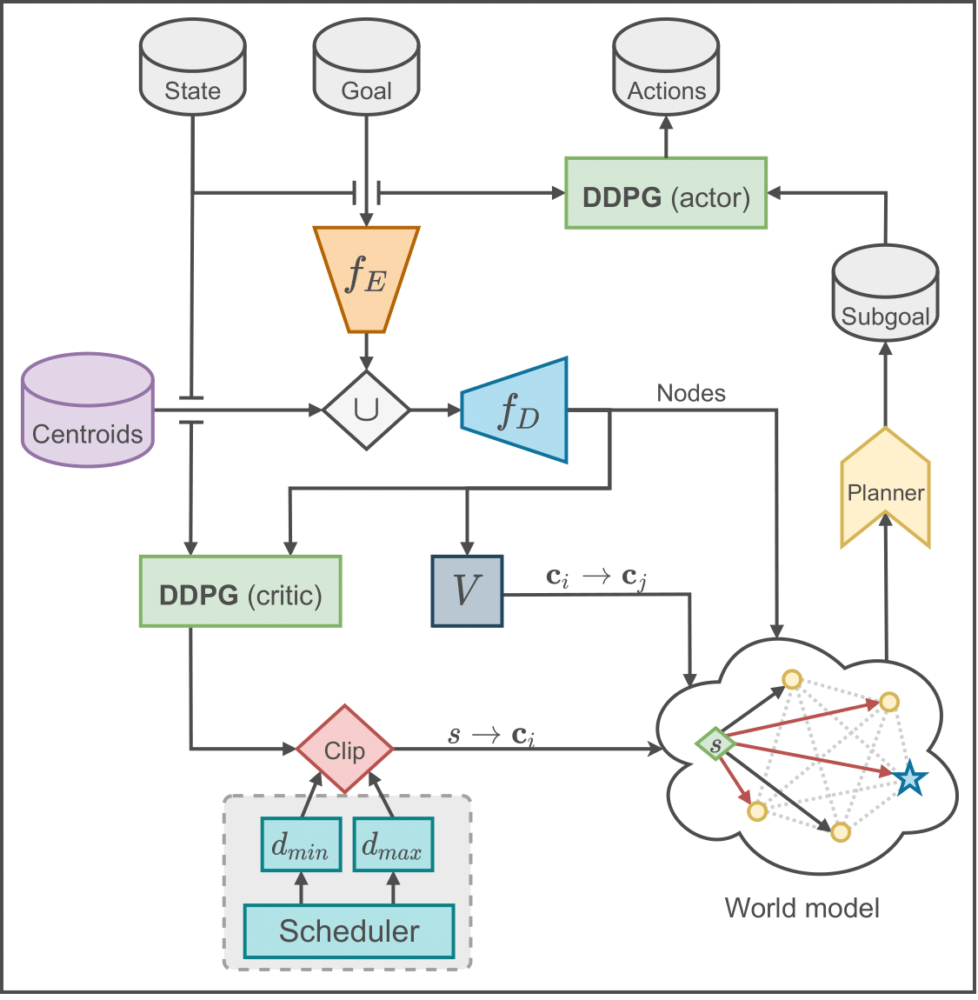

# Learning Latent Landmarks for Planning: Planning over Longer Distances
  

This project is an extension of the paper: [**World Model as a Graph: 
Learning Latent Landmarks for Planning**](https://arxiv.org/abs/2011.12491) ([GitHub](https://github.com/LunjunZhang/world-model-as-a-graph)) by Zhang et al. **World Model as a Graph: 
Learning Latent Landmarks for Planning** introduces a Model-based RL agent that generates a graph representation of its environment. They achieve this by generating landmarks, estimating the distance (i.e., the weights of the edges) between each pair of landmarks using the DDPG-critic. However, the longer the distance the less accurate the predictions are. To solve this, all edges are pruned that have a higher value than a threshold, **d<sub>max</sub>**.

## Our contribution

We introduce a new parameter: **d<sub>min</sub>**; as well as a **scheduler** for both parameters: **d<sub>max</sub>** and **d<sub>min</sub>** in order to change them during the training procedure. This contribution is highlighted, in grey, in the figure below.

<p align="center">
    
</p>

Please read the included [paper](./paper.pdf) for all the details with regards to our contribution. Demos of each scheduled agent are published on [YouTube](https://www.youtube.com/playlist?list=PLlmEThkxGpCoX7qdYt6kuM4uNPhSeU5mo).

## Requirements

The same packages as the original paper also apply to this repo:

```
python==3.7.4
numpy==1.19.5
torch==1.7.1+cu101
tensorflow==1.13.1
gym==0.13.1
mpi4py==3.0.3
mujoco_py==2.0.2.13
pandas==1.1.1
```


## Additional parameters
In order to run the code using schedulers one can add the following parameters to the call of `main_latent.py`:

* --square             : this parameter is used 
* --d_scheduler \["type"\] : this parameter is used to specify the type of scheduler: "linear", "exponential", or "logarithmic"
* --scheduler_max      : used to activate the max scheduler (can be used together with the min scheduler)
* --scheduler_min      : used to activate the min scheduler (can be used together with the max scheduler)
* --omega_max \[float\]    : a parameter for specify the length/width of the max scheduler
* --omega_min \[float\]    : a parameter for specify the length/width of the min scheduler
* --varpi \[float\]        : a parameter for specify the height of the min scheduler
* --test_scheduler     : a parameter used to plot the scheduler 
* --video \[int\]          : a parameter to make int amount of videos, for a demo
* --plot \[int\]           : a parameter to make int amount of trajectory plots in one figure, for a demo
* --legend             : used in conjunction with the plot parameter, toggles the legend of the plot
* --output             : used in conjunction with the plot or video parameters to specify the name of the output file

This is not a parameter we added, but d_window is set by the --dist_clip \[float\] parameter.


The `scripts`-directory contains all scripts that are used in order to conduct the experiments from the our paper. This includes the correct seeds and number of replications. There is also `args.txt`, which contains a brief description of most parameters that can be set via the command line.
